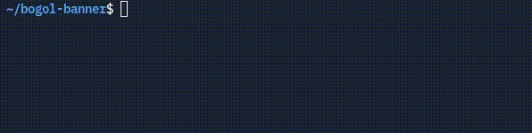

<p align="center"></p>

<h1 align="center">Bogol</h1>

<em><h5 align="center">(formerly Utility CLI)</h5></em>

[<p align="center">](https://github.com/Zuygui/Bogol/releases) [](https://npmjs.org/package/bogol) </p>

<p align="center">Use the CMD easy</p>



## Features

* 🔒 Computer management.
  * Show informations of computer and session

This is not an exhaustive list. Download and install the cli to gauge all it can do!

#### Need Help? [Check the wiki.][wiki]

#### Like the project? Leave a ⭐ star on the repository!

## Downloads

You can download from [NPM package](https://npmjs.org/package/bogol)

#### Latest Release

[](https://github.com/Zuygui/bogol/releases/latest)

#### Latest Pre-Release
[](https://github.com/Zuygui/bogol/releases)

**Supported Platforms**

If you download from the [Releases](https://github.com/Zuygui/Bogol/releases) tab, select the installer for your system.

| Platform | File |
| -------- | ---- |
| Windows x64 | `$ npm i -g bogol` |
| macOS x64 | `$ npm i -g bogol` |
| macOS arm64 | `$ npm i -g bogol` |
| Linux x64 | `$ sudo npm i -g bogol` |
| Linux arm64 | `$ sudo npm i -g bogol` |

## Console

To open the console in vs-code, use the following keybind.

```console
ctrl + shift + j
```

Ensure that you have the console tab selected. Do not paste anything into the console unless you are 100% sure of what it will do. Pasting the wrong thing can expose sensitive information.

## Development

This section details the setup of a basic developmentment environment.

### Getting Started

**System Requirements**

* [Node.js][nodejs] v16
* Admin Password

---

**Clone and Install Dependencies**

```console
> git clone https://github.com/Zuygui/bogol.git
> cd bogol
> npm install
```

---

**Install dev-version CLI**

```console
> sudo npm i -g
```

---

**Test Installation**

To test for your current platform.

```console
> bogol --help
```

Test for a specific platform.

| Platform    | Command              |
| ----------- | -------------------- |
| Windows x64 | `bogol --help`   |
| macOS       | `bogol --help`   |
| Linux x64   | `bogol --help` |

Test for macOS may work on Windows/Linux and vice-versa.

---

### Visual Studio Code

All development of the launcher should be done using [Visual Studio Code][vscode].

No code to paste the following into `.vscode/launch.json`

---

### Note on Third-Party Usage

Please give credit to the original author and provide a link to the original source. This is free software, please do at least this much.

---

## Resources

* [Wiki][wiki]
* [Module][bogol]

---

### See you in cmd.


[nodejs]: https://nodejs.org/en/ 'Node.js'
[vscode]: https://code.visualstudio.com/ 'Visual Studio Code'
[wiki]: https://github.com/Zuygui/bogol/wiki 'wiki'
[bogol]: https://npmjs.org/package/bogol 'bogol'
